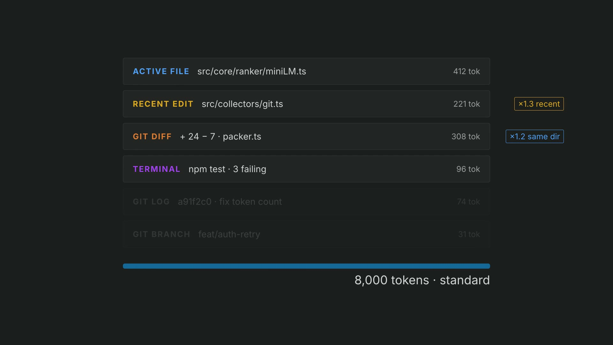

# Distyl

Distil your VS Code workspace into a prompt-ready context payload — automatically ranked, token-budgeted, clipboard-ready.

[](assets/brag.mp4)

*21 seconds: the ritual, one keystroke, and what comes back. [Watch](assets/brag.mp4).*

## The problem

Every time you prompt an AI assistant, you do the same invisible ritual first: copy-paste code snippets, reference docs, error logs, git state, and background into a chat window. The curation happens in your head, often poorly — too little context gets generic answers, too much produces noisy dilution. Distyl automates that step with a single keystroke.

## How it works

Four stages run on every `Cmd+Shift+C`:

```
Cmd+Shift+C → [Gather] → [Rank (MiniLM)] → [Pack (token budget)]
                                                      ↓
AI chat ← clipboard ← [Preview panel shows what was sent]
```

1. **Gather** — collectors pull chunks from your active file, recent edits, git diff/log, and terminal history
2. **Rank** — local `all-MiniLM-L6-v2` embeddings score each chunk against your prompt, with recency and directory-proximity boosts
3. **Pack** — greedy token packer fits the top-scoring chunks into your chosen budget (4k / 8k / 16k tokens)
4. **Deliver** — payload lands on your clipboard; the preview panel shows exactly what was sent and why

## VS Code extension install

1. Install from the VS Code Marketplace [Distyl](https://marketplace.visualstudio.com/items?itemName=David-T-Yu.distyl)
2. Press `Cmd+Shift+C` (Mac) / `Ctrl+Shift+C` (Windows/Linux)
3. Type what you're about to ask → Enter
4. Paste into Claude / ChatGPT / any AI chat

## Settings

| Setting         | Default    | Options                                                            |
| --------------- | ---------- | ------------------------------------------------------------------ |
| `distyl.budget` | `standard` | `focused` (4k tokens), `standard` (8k tokens), `deep` (16k tokens) |

## CLI install

```bash
npm install -g distyl-cli
distyl -p "fix the auth bug" | claude
```

Options:

```
distyl -p "your prompt"              # output packed context to stdout
distyl -p "..." --budget focused     # focused | standard | deep (default: standard)
distyl -p "..." --clipboard          # copy to clipboard instead of stdout
distyl -p "..." --baseline           # use BaselineRanker (no model download)
distyl --help
```

## How the ranker works

Distyl runs `all-MiniLM-L6-v2` (a 22M-parameter sentence embedding model) entirely locally via `@xenova/transformers` — no API calls, no data leaves your machine. Each chunk is embedded, cosine similarity is computed against your prompt embedding, then two boosts are applied multiplicatively: **1.3×** for chunks modified in the last 5 minutes, **1.2×** for chunks in the same directory as your active file. The top 20 chunks (noise floor 0.1) are handed to the packer. Embeddings are cached in SQLite keyed by content hash, so repeated runs are near-instant.

The `--baseline` flag uses a source-priority heuristic (active file → recent edits → git diff hunks by recency) without any embeddings — useful for A/B comparison or instant results on first run.

## Known limitations

- Single workspace folder (multi-root monorepos: picks the first folder)
- CLI recent-edits uses file mtime — approximate compared to VS Code's event stream
- First CLI run downloads MiniLM weights (~80 MB from HuggingFace); subsequent runs use the embedding cache
- Terminal collector requires VS Code shell integration (bash/zsh with VS Code shell integration enabled)
- Preview panel is read-only in V1 (manual chunk editing: V1.1)

## Development

```bash
npm install
npm run compile       # one-shot build → dist/extension.js
npm run compile:cli   # build CLI → dist/cli.js
npm run watch         # rebuild on change
npm run check-types   # tsc --noEmit
npm test              # run test suite
```

Press **F5** in VS Code to launch the Extension Development Host, then press `Cmd+Shift+C` and type your prompt.

## Demo


